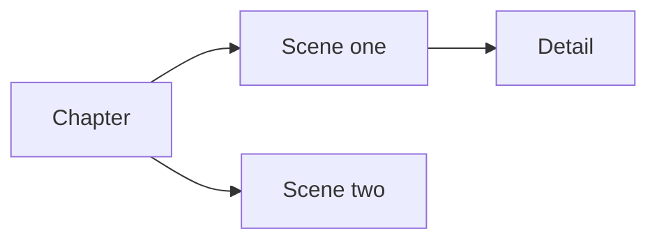

# Cardamomo

**A distraction-free space to write, one connected card at a time.**

Cardamomo is a Markdown writing app that lets you arrange your ideas in a branching canvas. Start with a single blank card, develop a thought downward, or branch to the right to explore its details. Move, fold, split, and merge your writing as it takes shape, then export it as a Markdown document.

**[Open Cardamomo →](https://cardamomo-app.github.io/cardamomo/)**

No account required. Your current draft saves automatically in your browser.

[Getting started](#getting-started) · [Controls](#controls) · [Shortcuts](#keyboard-shortcuts) · [Files and storage](#files-and-storage) · [Run locally](#running-locally) · [License](#license)

## What you can do

- **Write in Markdown**, with formatted previews, bold and italic shortcuts, and natural paragraph editing.
- **Organize ideas in columns**, with connected cards and branching relationships.
- **Reshape a draft** by dragging whole branches, splitting cards at the cursor, or merging neighboring cards.
- **Focus on a passage** by folding branches, switching themes, and entering fullscreen focus mode.
- **Work from the keyboard** to create cards, move between them, and merge them in edit mode.
- **Bring your own files** by importing Markdown headings into columns and exporting your writing back to Markdown.

## Getting started

1. [Open the app](https://cardamomo-app.github.io/cardamomo/) and click the blank card to begin writing.
2. Use **+ below** for another card in the same column, or **+ right** to add a child in the next column.
3. Click outside a card to see its rendered Markdown. Click it again to continue editing.
4. Give the document a title at the top. Your draft saves as you work.
5. Use **Save** to keep a `.cardamomo` document for later editing, or **Export** for a plain Markdown copy.

## The canvas

Cards occupy fixed horizontal columns. A card can have **children** to its right; those children can have children of their own. Cards sharing a parent are **siblings**. A card and all its descendants form a **branch**.



The columns give your writing structure without dictating what belongs in a card. A card can hold a heading, a paragraph, a scene, a list, or a longer passage.

Opening a card for writing centers its column in the viewport. Extra space beyond the last column lets you write in the middle of the screen. Scrolling is smooth unless your system requests reduced motion.

## Controls

### Document toolbar

The controls run left to right: **Undo, Redo · New, Open, Save, Export**.

| Control | What it does |
| --- | --- |
| Document title | Names the draft and its exported file. |
| Save status | Shows whether the draft has saved in this browser. |
| Undo ↶ | Restores a previous draft state, including structural changes. |
| Redo ↷ | Reapplies the last undone draft change. |
| Blank page | Starts a new document with one empty card. Undo can restore the previous draft. |
| Open folder | Opens a `.cardamomo` document or a Markdown file and replaces the current draft. Undo can restore the previous draft. |
| Save (disk icon) | Downloads a `.cardamomo` document with its complete card structure, folds, zoom, and canvas position. |
| Export (download icon) | Downloads your writing as a Markdown file. |

### Cards and connections

| Control | What it does |
| --- | --- |
| Card body | Opens the card for editing. |
| + above / below | Adds a sibling before or after the card. |
| + on a vertical connection | Inserts a card between siblings. |
| + to the right | Adds the first child. Add more children using the controls above or below an existing child. |
| Top drag handle | Moves a card and its entire branch within or between columns. |
| × | Removes the card and lifts its children one column to the left. Undo restores it. |
| Outgoing horizontal line | Highlights on hover; click to fold all descendants. |
| Small square on a folded line | Expands the branch again. |

### Canvas toolbar

| Control | What it does |
| --- | --- |
| Card and word counts | Counts the entire draft, including folded cards. |
| − / + | Adjusts canvas zoom from 50% to 150%. |
| Zoom percentage | Resets zoom to 100% and returns to the start of the canvas. |
| Moon / sun | Switches between light and dark mode. Your preference is saved in this browser. |
| Focus icon | Requests true page fullscreen and hides the header and statistics. Click again or press Escape to leave. Requires browser fullscreen support. |
| Coffee cup | Opens a Ko-fi tip panel to support Cardamomo with a voluntary contribution. |
| ? | Opens the writing guide. |

## Writing and organizing

### Markdown editing

Write Markdown directly in a card. Headings, **bold**, *italic*, lists, links, blockquotes, and code render when you leave edit mode. The app uses DM Mono, with normal and italic faces and stronger bold styling in previews.

**Enter** starts a paragraph. **Shift + Enter** inserts a Markdown hard line break. Select text and use the formatting shortcuts to add bold or italic markers; selecting the marked text and repeating the shortcut removes those markers.

### Moving and folding branches

Drag the handle at the top of a card to reorder it or move it to another column. Drop above or below another card to make it a sibling, or beside a parent in the preceding column to attach it as a child. Its descendants travel with it. Press Escape to cancel a drag.

Click the horizontal line leaving a card to fold its descendants. Click the square to expand them. Nested folds retain their own state, and folded writing remains saved and included in exports.

### Splitting a card

Press **Cmd/Ctrl + Enter** while editing to split at the cursor. The text after the cursor moves to a new sibling below, which opens for writing. If text is selected, that selection stays in the lower card. Existing children remain attached to the upper card.

### Merging cards

Use **Option/Alt + Ctrl + Shift + an arrow** to merge the active card with a neighbor.

| Direction | Result | Constraint |
| --- | --- | --- |
| Up / Down | The upper card survives, with its text first. Both sets of children attach in upper-then-lower order, keeping their columns. | The neighboring visible cards must be in the same column and share a parent. |
| Left | The current card merges into its parent. The parent survives, with its text first. | A parent must exist and its branch must be expanded. |
| Right | The first child merges into the current card. The parent survives, with its text first. | A child must exist and the branch must be expanded. |

For a horizontal merge, the selected child's children take its place among the parent's children. Their whole branch shifts left by the parent–child column distance, preserving relative spacing. Other sibling branches keep their order. Branching cards are supported: no descendants are deleted.

Merged text is separated by a paragraph. The surviving card expands and opens for writing; nested fold states remain intact. A merge that cannot be performed leaves the draft unchanged and explains why.

Because the combined text belongs to one card, it appears before that card's children in an export. Merging can therefore change reading order—for example, merging a later child into its parent places that child's text before the remaining children.

Use **Undo**, or **Cmd/Ctrl + Z immediately after a split or merge**, to restore the previous cards, text, and branches.

## Keyboard shortcuts

**Cmd** means Command on macOS; **Option** is the macOS name for **Alt**. Where a shortcut says **Cmd/Ctrl**, use Command on macOS or Control on Windows/Linux. Shortcuts written with **Ctrl** specifically use Control on every platform.

### Write and edit

| Shortcut | Action |
| --- | --- |
| Enter | Starts editing a focused card; while editing, starts a new paragraph. |
| Shift + Enter | Inserts a Markdown hard line break while editing. |
| Cmd/Ctrl + B | Toggles bold markers around selected text. |
| Cmd/Ctrl + I | Toggles italic markers around selected text. |
| Cmd/Ctrl + Enter | Splits the card at the cursor and opens the new card below. |
| Cmd/Ctrl + S | Downloads a `.cardamomo` document while keeping your current editing position. |
| Escape | Leaves focus mode, finishes editing, or cancels an active drag. |

### Create cards

These shortcuts work while editing or focusing a card. The new card opens for writing.

| Shortcut | Action |
| --- | --- |
| Ctrl + Shift + ↑ | Creates a sibling above. |
| Ctrl + Shift + ↓ | Creates a sibling below. |
| Ctrl + Shift + → | Creates a first child, when the right-hand + is available. |

### Navigate between cards

These shortcuts save the current writing and open the destination in edit mode. At an edge, the current card stays active.

| Shortcut | Destination |
| --- | --- |
| Option/Alt + Ctrl + ↑ | Previous visible card in the same column. |
| Option/Alt + Ctrl + ↓ | Next visible card in the same column. |
| Option/Alt + Ctrl + ← | Parent card. |
| Option/Alt + Ctrl + → | First child, expanding a folded branch if needed. |

### Merge and undo

| Shortcut | Action |
| --- | --- |
| Option/Alt + Ctrl + Shift + ↑ / ↓ | Merges with the card above or below, subject to the [merge rules](#merging-cards). |
| Option/Alt + Ctrl + Shift + ← | Merges the current card into its parent. |
| Option/Alt + Ctrl + Shift + → | Merges the first child into the current card. |
| Cmd/Ctrl + Z | Undoes typing while editing; immediately after splitting or merging, undoes that operation. Outside text inputs, restores the previous draft state. |
| Cmd/Ctrl + Shift + Z | Redoes draft operations outside text inputs. |

## Files and storage

### Save a Cardamomo document

Use the **Save** disk icon or **Cmd/Ctrl + S** to download a `.cardamomo` file. It preserves the document title, exact Markdown text, empty and headingless cards, card order, parent–child connections, column positions, every collapsed branch, zoom, and canvas scroll position.

Move that file to another device and use **Open** to continue with the same document structure. Cardamomo files are versioned JSON documents; no account or server is needed. Files are validated before replacing the draft, and a damaged or unsupported file leaves the current writing intact.

Save downloads a snapshot rather than automatically overwriting a previously opened file. Browser autosave continues independently. Save a fresh copy before moving devices. Undo history, the text cursor, and device preferences such as theme and fullscreen are not part of the file. The viewport may fit differently on a different screen size.

### Import Markdown

The same folder button accepts `.cardamomo` documents and `.md`, `.markdown`, `.mdown`, `.mkd`, and `.txt` files.

Heading levels become columns, starting with the highest level present in the document. Every heading starts a separate card containing that heading and its following body text. Two H3 headings become two cards in the same column. Lower-level headings attach beneath the preceding higher-level heading; skipped parent headings retain their column alignment.

Text before the first heading becomes a separate card. A file without headings opens as one card. Heading-like text inside code blocks or blockquotes stays part of its existing card.

### Export Markdown

Export follows the tree in reading order: a root card, its children and their descendants, then the next root card. Folded cards are included. Card contents are joined with blank lines; empty cards do not add text, and column positions do not automatically create headings.

Use Save for an exact card-structure backup. A Markdown export is a portable writing document. Reopening it rebuilds cards from its Markdown headings; it does not restore arbitrary card boundaries, folding, or layout.

### Browser storage

Cardamomo keeps one current draft in browser-local storage. There is no account or cloud synchronization. Different browsers, devices, and website addresses have separate drafts. Clearing site data can remove the saved draft, so save `.cardamomo` copies you want to keep.

New and Open replace the current draft. Undo can restore it during the current session, but undo history does not survive a reload. Avoid editing separate drafts in multiple tabs at the same address: they share the same storage.

The app bundles its fonts and rendering libraries. Images referenced in your Markdown may load from their original URLs. Opening the support panel loads an embedded payment form from Ko-fi.

### Install as an app

Use your browser's installation or Add to Dock / Home Screen option where supported. Cardamomo includes an app manifest, favicon, Apple touch icon, and regular and maskable icons for installed use. Installation availability depends on the browser; the app does not currently provide a service worker for guaranteed offline loading.

## Running locally

Cardamomo is a static app built with browser-native JavaScript and CSS. The runnable app is in `dist/`; no build step or dependency installation is needed to serve it.

With Git and Python 3 installed:

```sh
git clone https://github.com/cardamomo-app/cardamomo.git
cd cardamomo
python3 -m http.server 8000 --bind 127.0.0.1 --directory dist
```

Open **[localhost:8000](http://127.0.0.1:8000/)** in your browser. You can use any other static web server instead.

Serve the folder over HTTP rather than double-clicking `index.html`: browsers restrict JavaScript modules on `file://` pages. Keep using the same local address and port to return to the same browser-stored draft.

### Project layout

```text
dist/                       Static website, served directly
  index.html                App shell and writing guide
  app-native-v16.js          Main app behavior
  *.mjs                     Tree, editing, import, and layout modules
  style.css                 Canvas, cards, and themes
  assets/                   Fonts, Markdown renderer, sanitizer, licenses
  icons/                    Favicon and installation icons
  manifest.webmanifest      Installed app metadata
tests/                      Node.js tests
scripts/generate-icons.cjs   Icon generation utility (requires sharp)
.github/workflows/pages.yml GitHub Pages deployment
```

### Tests and deployment

With Node.js installed, run the tests from the repository root:

```sh
node --test tests/*.test.mjs
```

The GitHub Actions workflow publishes `dist/` to GitHub Pages on pushes to `main`. For a fork, select **GitHub Actions** under **Settings → Pages → Build and deployment**. Icons are already generated and committed; regenerating them is optional.

## Contributing

[Report a bug or suggest an improvement](https://github.com/cardamomo-app/cardamomo/issues). For bugs, include your browser, operating system, steps to reproduce, and a small Markdown example when relevant. Please leave private writing out of reports.

Pull requests are welcome. Keep changes focused, describe the resulting behavior, and add or update relevant tests when changing editing or tree operations.

## Credits

Created by **Cardamomo**, inspired by the branching writing approach of Gingko Writer.

Cardamomo includes the following third-party assets, each under its own license:

| Asset | License |
| --- | --- |
| DM Mono | [SIL Open Font License](dist/assets/OFL.txt) |
| Marked 15.0.12 | [MIT](dist/assets/MARKED-LICENSE.md) |
| DOMPurify 3.2.6 | [Apache-2.0 OR MPL-2.0](dist/assets/DOMPURIFY-LICENSE.txt) |
| Inconsolata (retained font asset) | [SIL Open Font License](dist/assets/INCONSOLATA-LICENSE.txt) |

## License

Cardamomo's original source code and documentation are available under the **[MIT License](LICENSE)**. Third-party assets retain their respective licenses listed above.
